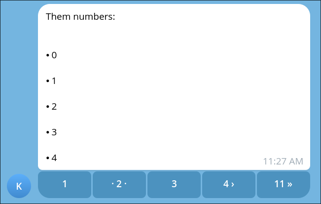

This guide explains how to send paginated messages in Kamihi, allowing you to break down long content into manageable pages that users can navigate through.

## Sending paginated messages

To send paginated messages, you can use the `bot.Pages` class. This class allows you to define multiple pages of content and send them as a single message that users can navigate through.

To do this, you will need two things: a list of items to paginate, and a template to render each page.

=== "send_paginated_items/send_paginated_items.py"

    ```python
    from kamihi import bot
    from jinja2 import Template
    from typing import Annotated
    
    @bot.action
    async def send_paginated_items(
        data: list[str],
        template: Template
    ):
        return bot.Pages(
            items=data,
            template=template,
            items_per_page=5  # Number of items per page
        )
    ```

=== "send_paginated_items/send_paginated_items.md.jinja"

    ```md
    
    - {{ item }}
    
    ```

Since data items are passed directly to the template, they can be of any type that the template can handle. In this example, we are using a list of strings, but you can use more complex data structures as needed.

When the action is called, Kamihi will render the template for each page using the corresponding items and send the paginated message to the user. Users will be able to navigate through the pages using inline buttons.



## The first page

You can optionally provide a `first_page_template` argument to the `bot.Pages` constructor. This template will be used to render the first page of the paginated message, allowing you to customize its appearance or content. This is useful for help pages or introductions. The first page template will not be passed any items.
