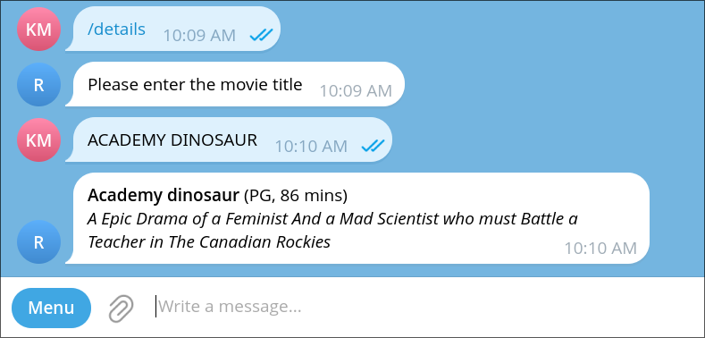

In this tutorial, you will learn how to employ reusable questions in your actions to get information from the user. This will enhance your bot's interactivity and allow it to gather necessary data seamlessly.

By the end of this tutorial, you will have created an action that asks the user for a movie title, and returns the details of that movie from the Sakila database.

## Reusable questions

Kamihi provides a convenient way to ask users questions and handle their responses through reusable question types. This feature allows you to define a question type once and use it across multiple actions.

Kamihi already has some built-in question types that we can use. You can check out the list of available questions in the [questions guide](../guides/actions/ask-questions.md).

In this tutorial we will be using some of these built-in questions to ask the user for a movie title. Additionally, we will learn how to use the answers in out queries and actions, in this case for retrieving movie details from the Sakila database.

## Creating the `details` action

Let's create a new action called `details` that will ask the user for a movie title and return the details of that movie from the Sakila database. You should already know how to do it, but just in case, I'll show you again. Run the following command:

<!-- termynal -->
```shell
> kamihi action new details
Copying from template version x.x.x
 identical  actions
    create  actions/details
    create  actions/details/details.py
    create  actions/details/__init__.py

```

We want to obtain the movie title from the user, then query the database for that movie, and finally return the details to the user. Let's start by editing the `details.py` file to implement this logic. Update the file as follows:

=== "`actions/details/details.py`"

    ```python
    """
    details action.
    """
    from kamihi import bot
    from kamihi.questions import String
    from typing import Annotated

    @bot.action
    async def details(title: Annotated[str, String("Please enter the movie title")]) -> str:
        """
        Get movie details from the Sakila database.
        """
        return title  # (1)!
    ```

    1. For now, we are just returning the title provided by the user to verify that we are receiving it correctly.

With this change, when the `details` action is invoked, it will ask the user for a movie title using the `String` question type. The user's response will be passed to the `title` parameter of the action. You can test this by running your bot and invoking the `details` action. You should see a prompt asking for the movie title, and after you provide it, the bot should respond with the title you entered.

## Query templates

In the same way that we can create message templates to format the output of our actions, we can also create query templates to construct SQL queries dynamically based on user input or other parameters. This is particularly useful when we want to filter results based on user-provided criteria, such as the movie title in our case.

Query templates in Kamihi are located in the same place as plain queries, that is, in the action's folder, and follow the same naming conventions. The only difference is that query templates use the `.sql.jinja` extension instead of just `.sql`.

```
<action_name>.<datasource_name>.sql.jinja
```

When the query is going to be executed, Kamihi will include in the template context all the possible parameters of an action (see [here](../guides/actions/parameters.md) for a list). This allows us to use those parameters to build dynamic queries.

## Creating a query template for the `details` action

Let's create a query template for the `details` action that will retrieve the details of a movie based on the title provided by the user. Create a new file called `details.sakila.sql.jinja` under the `actions/details` folder with the following content:

=== "`actions/details/details.sakila.sql.jinja`"

    ```sql
    SELECT film_id, title, description, length, rating
    FROM film
    WHERE title = '{{ title }}'  -- (1)!
    LIMIT 1;
    ```

    1. We use the `title` variable (always the same name as the action parameter) to filter the results based on the movie title provided by the user.

Now, we need to modify the `details.py` action to use this query template to fetch the movie details from the database. We will update the action and add also a template to format the output message. Update the files as follows:

=== "`actions/details/details.py`"

    ```python
    """
    details action.
    """
    from typing import Annotated
    
    from jinja2 import Template
    from kamihi import bot
    from kamihi.questions import String
    
    
    @bot.action
    async def details(
        title: Annotated[str, String("Please enter the movie title")], 
        data: list, # (1)!
        template: Template
    ) -> str:
        """
        details action.
    
        Returns:
            str: The result of the action.
    
        """
        if not data: # (2)!
            return f"No movie found with title '{title}'."
    
        return template.render(movie=data[0]) # (3)!

    ```

    1. We add the `data` parameter to receive the results of the query defined in the `details.sakila.sql.jinja` file.
    2. We need to take into account that the query may return no results if the movie title provided by the user does not exist in the database.
    3. Then we render the template passing the first (and only) result of the query as the `movie` variable.

=== "`actions/details/details.md.jinja`"

    ```jinja
    **{{ movie.title | capitalize }}** ({{ movie.rating }}, {{ movie.length }} mins)
    _{{ movie.description }}_
    ```

With these changes, when the `details` action is invoked, it will ask the user for a movie title, execute the query to fetch the movie details from the database, and then format the output using the `details.md.jinja` template.



??? info "A note on parameter ordering"
    It does not matter the order of the parameters in the action signature, meaning that you can define the `title` parameter after the `data` parameter if you want. Kamihi will always ask questions first before executing the queries or rendering templates.

## Validating answers

In the previous example, we used the `String` question type to ask the user for a movie title. However, this question type does not perform any validation on the user's input, meaning that we need to handle cases where the user provides an invalid title (e.g., a title that does not exist in the database). This is annoying not only because we have to write extra code, but also because to try again the user has to invoke the action from the beginning.

Thankfully, there are better ways to handle this. One way would be to use the available parameters that the `String` question type provides for validation, such as `min_length`, `max_length` or `pattern`. But in our case we want to validate the title against the database, so we will use a special question type called `DynamicChoice`.

The `DynamicChoice` question type allows us to provide a query file that will be executed to fetch the valid choices for the question. The user's answer will then be validated against these choices, and if the answer is not valid, the user will be prompted to try again without having to resend the command.

To do this, first we need to create a query that will return the list of valid movie titles from the database. This query will, however, not be associated with any particular action, so it can be reused in multiple actions if needed. This means that instead of placing the query under the `actions/details` folder, we will place it under a new folder called `questions` in the root of the project. Another important detail is that since this query is not associated with any action, it needs to be stateless, meaning it cannot be a template. Therefore, we will create a plain SQL file instead of a Jinja template.

Go ahead and create the `questions` folder if it does not exist yet, then create a new file called `movie_title.sakila.sql` inside with the following content:

=== "`questions/movie_title.sakila.sql`"

    ```sql
    SELECT title  -- (1)!
    FROM film;
    ```

    1. The query should return a single column if it is to be used with the `DynamicChoice` question type. Other columns will be ignored.

Now, we can modify the `details.py` action to use the `DynamicChoice` question type with the `movie_title.sakila.sql` query for validating the movie title. Update the file as follows:

=== "`actions/details/details.py`"

    ```python
    """
    details action.
    """
    from jinja2 import Template
    from kamihi import bot
    from kamihi.questions import DynamicChoice
    from typing import Annotated, Any
    
    @bot.action
    async def details(
        title: Annotated[
            str,
            DynamicChoice(
                "Please enter the movie title",
                request="movie_title.sakila.sql",  # (1)!
                error_text="That title was not found. Please try again."  # (2)!
            )
        ],
        data: list[Any],
        template: Template
    ) -> str:
        """
        Get movie details from the Sakila database.
        """
        return template.render(movie=data[0])

    ```

    1. The `query_file` parameter of the `DynamicChoice` question type specifies the query that will fetch the valid movie titles from the database. It is relative to the `questions` folder in the root of the project.
    2. We use the `error_text` parameter to customize the message that will be shown to the user when they provide an invalid title.

With this change, when you call the `/details` command, the bot will ask for a movie title and validate the user's input against the titles returned by the `movie_title.sakila.sql` query. If the user provides an invalid title, they will be prompted to try again without having to resend the command.


## Making a custom question

You can probably deduce that, if we are making a rentals bot, then we will need to ask users for movie titles quite often. To avoid duplicating the same code in multiple actions, we can create a custom question type that encapsulates the logic for asking and validating movie titles. This way, we can reuse this custom question type in any action that requires a movie title in the same way we can reuse built-in question types like `String` or `DynamicChoice`.

To create a custom question type, we need to define a new class that inherits from one of the existing question types and customize its behavior as needed. In our case, we will create a new question type called `MovieTitle` that inherits from `DynamicChoice` and uses the `movie_title.sakila.sql` query for validation.

Let's create a new file called `movie_title.py` under the `questions` folder and define the `MovieTitle` question type. Also, we will create an `__init__.py` file in the same folder to make it a package, and export the `MovieTitle` class. Create the files as follows:

=== "`questions/movie_title.py`"

    ```python
    """
    MovieTitle question type.
    """
    from kamihi.questions import DynamicChoice
    
    class MovieTitle(DynamicChoice):  # (1)!
        """
        Question type to ask for a movie title.
        """
    
        def __init__(self):
            super().__init__(  # (2)!
                "Please enter the movie title",
                request="movie_title.sakila.sql",
                error_text="That title was not found. Please try again."
            )

    ```

    1. We inherit from the `DynamicChoice` type since we want to leverage its validation capabilities.
    2. We call the parent constructor with the appropriate parameters for our movie title question, which will be constant no matter which action uses it.

=== "`questions/__init__.py`"

    ```python
    """
    Questions package.
    """
    from .movie_title import MovieTitle  # (1)!
    ```

    1. We export the `MovieTitle` class to make it accessible when importing from the `questions` package.

Now, we can modify the `details.py` action to use the new `MovieTitle` question type instead of directly using `DynamicChoice`. Update the file as follows:

=== "`actions/details/details.py`"

    ```python
    """
    details action.
    """
    from jinja2 import Template
    from kamihi import bot
    from questions import MovieTitle  # (1)!
    from typing import Annotated, Any

    @bot.action
    async def details(
        title: Annotated[
            str,
            MovieTitle()  # (2)!
        ],
        data: list[Any],
        template: Template
    ) -> str:
        """
        Get movie details from the Sakila database.
        """
        return template.render(movie=data[0])

    ```

    1. We import the `MovieTitle` question type from the `questions/movie_title.py` file.
    2. We use the `MovieTitle` question type directly to ask for and validate the movie title.

With this change, the `details` action will still function the same way as before, but now it uses the custom `MovieTitle` question type for asking and validating the movie title. This makes the code cleaner and allows us to reuse the `MovieTitle` question type in other actions without duplicating code. It also looks neater.

## Input formatting

One last thing! As you may have noticed, in the database the movie titles are all in uppercase. That is why in the template we put `{{ movie.title | capitalize }}`: the `capitalize` filter makes the first letter uppercase and the rest lowercase, which looks better. However, this also means that the user needs to enter the title in uppercase, otherwise the query will not find it. To avoid this problem, we can format the user's input before validating it. Kamihi provides a way to do this using the `validate_before` method of question types. We can override this method in our `MovieTitle` question type to convert the user's input to uppercase before validating it against the database. Let's update the `MovieTitle` class as follows:

=== "`questions/movie_title.py`"

    ```python
    """
    MovieTitle question type.
    """
    from typing import Any
    
    from kamihi.questions import DynamicChoice
    from sqlalchemy import Update
    from telegram.ext import CallbackContext
    
    
    class MovieTitle(DynamicChoice):
    """
    Question type to ask for a movie title.
    """
    
        def __init__(self):
            super().__init__(
                "Please enter the movie title",
                request="movie_title.sakila.sql",
                error_text="That title was not found. Please try again."
            )
    
        async def validate_before(  # (1)!
                self,
                response: Any,
                _update: Update | None = None,  # (2)!
                _context: CallbackContext | None = None,
        ) -> Any: 
            """
            Format the answer before validation.
    
            Args:
                response (Any): The user's response.
                _update (Update | None): The update object.
                _context (CallbackContext | None): The callback context.
    
            Returns:
                str: The formatted answer.
            """
            return response.upper()  # (3)!

    ```

    1. We override the `validate_before` method to format the user's input before validation.
    2. The `_update` and `_context` parameters are not used in this case, but they are included to match the base class method signature.
    3. We convert the input to uppercase using the `upper()` method.

If you try the `details` action again, you will see that now the user can enter the movie title in any case (uppercase, lowercase, mixed case), and it will still be validated correctly against the database. This makes the user experience much better!


## TL;DR

- Kamihi provides reusable question types to ask users for input in actions.
- You can create query templates to build dynamic SQL queries based on user input. Inside these templates, you can access action parameters.
- The `String` question type can be used to ask for text input, but it does not perform validation.
- The `DynamicChoice` question type allows you to validate user input against a list of choices fetched from a stateless query in the `questions` folder.
- You can create custom question types by inheriting from existing ones and encapsulating common logic for reuse.
- You can override the `validate_before` method in custom question types to format user input before validation.
- By using these features, you can create interactive actions that gather necessary data from users, validate their input effectively and use that input in the action.

## What's next?

Do take a look at the different [question types available](../guides/actions/ask-questions.md#available-question-types) in Kamihi. You can use them to ask for different kinds of input from users, such as integers, booleans, dates, files, and more. They also provide various validation options to ensure that the input received is valid by the time it reaches the code inside your action.

In the next tutorial, we will learn how to store persistent data for our users in Kamihi's database, allowing us to create personalized experiences for each user. Stay tuned!
