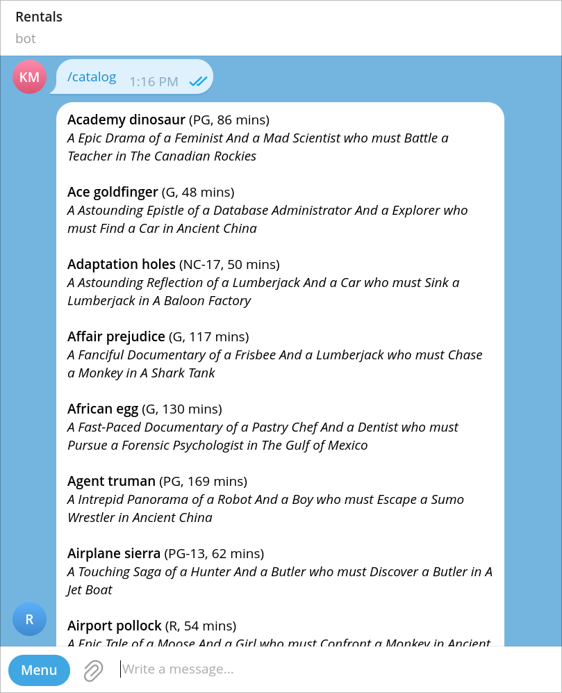
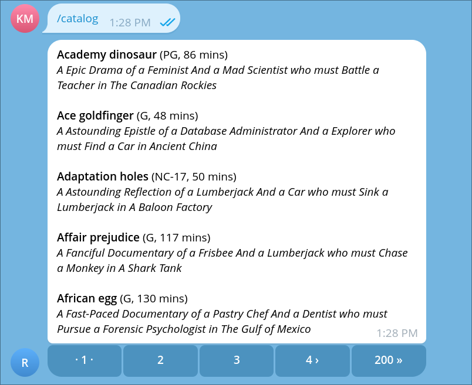

In this tutorial, we will make use of templates and pagination to enhance the presentation of our bot's messages.

By the end of this tutorial, you will have a `catalog` action that displays a list of movies from the Sakila database using a Jinja template, and allows users to navigate through the catalog using pagination.

## Jinja templates

Kamihi uses [Jinja](https://jinja.palletsprojects.com/en/latest/) as its templating engine, which allows us to create dynamic and reusable message formats. To understand more about the syntax and features of Jinja, you can refer to the [Jinja documentation](https://jinja.palletsprojects.com/en/latest/templates/).

Templates are specific to each action and live in the action's folder, using the file name format `<action_name>.<extension>.jinja`. Since messages are formatted as Markdown by default, we will use the `.md.jinja` extension for our message templates. This template will then be automatically loaded and made available to the action as a `template` parameter.

??? info "More template file and parameter names"
    There are more ways to name your template files and parameters. You can check them out in the [template guide](../guides/actions/use-templates.md).

## Creating a template for the `catalog` action

Let's create a template for the `catalog` action we created in the previous tutorial. This template will format the list of movies in a more appealing way. Create a new file called `catalog.md.jinja` under the `actions/catalog` folder with the following content:

=== "`actions/catalog/catalog.md.jinja`"
    ```jinja
    
    **{{ movie.title | capitalize }}** ({{ movie.rating }}, {{ movie.length }} mins)
    _{{ movie.description }}_
    
    ```

Don't worry if you do not understand all the syntax used in the template. The important part is that we are using a `for` loop to iterate over the `data` variable, which contains the list of movies returned by our SQL query. For each movie, we display its title (capitalized, bold), rating, length, and description (in italics).

Now, we need to modify the `catalog.py` action to use this template for rendering the message instead of constructing the message manually. Update the `catalog.py` file as follows:

=== "`actions/catalog/catalog.py`"
    ```python
    """
    catalog action.
    """
    from kamihi import bot
    from jinja2 import Template

    @bot.action
    async def catalog(data: list, template: Template) -> str:
        """
        List movies from the Sakila database.
        """
        return template.render(data=data) # (1)!
    ```

    1. We use the `template` parameter to access the Jinja template and render it passing the `data` variable.

With this change, when the `catalog` action is invoked, it will use the `catalog.md.jinja` template to format the list of movies before sending it to the user.



## Getting more results with pagination

If you remember, in the previous tutorial we limited the number of movies returned by our SQL query to 10. This was done because Telegram has a message size limit of 4096 characters, and we wanted to avoid exceeding that limit. However, this also means that users can only see the first 10 movies in the catalog.

To allow users to browse through the entire catalog, we will add a paginated view to the `catalog` action. This will enable users to request more results in chunks of 10 movies at a time.

Pagination in Kamihi can be added to any message by returning a `bot.Pages` object from the action instead of a simple string. The `bot.Pages` object takes care of splitting the message into pages and providing navigation buttons to move between them.

Let's modify the `catalog.py` action to implement pagination. Update the files as follows:

=== "`actions/catalog/catalog.py`"
    ```python
    """
    catalog action.
    """
    from kamihi import bot
    from jinja2 import Template

    @bot.action
    async def catalog(data: list, template: Template) -> bot.Pages:
        """
        List movies from the Sakila database.
        """
        return bot.Pages(
            data=data, # (1)!
            page_template=template, # (2)!
            items_per_page=5 # (3)!
        )
    ```

    1. Pages only work if we have a list of items to paginate, so we pass the `data` variable as before.
    2. We specify the `page_template` parameter to use our Jinja template for
         rendering each page. We don't really need to change the template, as it will be used as is for each page.
    3. We set the `items_per_page` parameter to 5, so each page will display 5 movies. You can adjust this number as needed, but keep in mind the Telegram message size limit.
=== "`actions/catalog/catalog.sakila.sql`"
    ```sql
    SELECT film_id, title, description, length, rating
    FROM film
    ORDER BY title; -- (1)!
    ```

    1. We remove the `LIMIT 10` clause from the SQL query, so we can fetch all movies from the database. Pagination will take care of displaying them in chunks.

With this change, when the `catalog` action is invoked, it will return a paginated view of the movie catalog. Users can navigate through the pages using the provided buttons.



## TL;DR

- Kamihi uses the Jinja templating engine for formatting messages.
- Templates are stored in the action's folder with the `<action_name>.<extension>.jinja` naming convention and are accessible via the `template` parameter.
- Pagination can be implemented by returning a `bot.Pages` object from the action. This allows users to navigate through large datasets in manageable chunks.

## What's next?

You can now send the `/catalog` command to your bot and see the formatted and paginated list of movies from the Sakila database. In the next tutorial, we will learn how to get data from users through questions and use it in our actions, queries and templates. Stay tuned!
